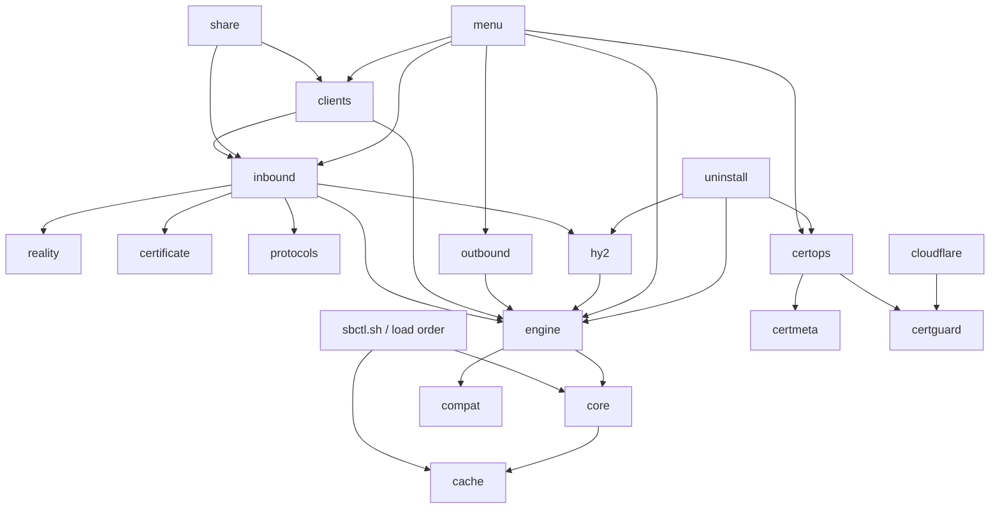

# sbctl 架构审计（重构前基线）

审计基线：`2e82d91`（`main`）。审计范围包括 `sbctl.sh`、`install.sh`、`lib/*.sh`、`tests/*.sh` 与 CI 配置。

## 结论摘要

当前代码共有 26 个运行时模块、约 4,200 行库代码。配置事务已经有一个可复用雏形（`apply_candidate_with_meta`），但是模块边界仍以历史修复来源为主：三个 `*_guard.sh` 晚加载覆盖正式函数，两个模块是空壳，证书生命周期横跨六个文件，协议 builder、TLS/REALITY 与入站 CRUD 同处 `inbound.sh`。安装器必须逐个下载 26 个模块。

本次重构采用机械迁移优先的方式：保留公开函数和 CLI 行为，把唯一实际生效的实现移动到领域模块，再逐步加领域前缀。第一轮不改变 config/meta schema，也不改变协议默认值。

## A. 当前模块职责表

| 文件 | 当前职责 | 主要调用 | 主要调用方 | 混乱点 | 建议归属 |
|---|---|---|---|---|---|
| `lib/cache.sh` | 会话缓存、平台/服务状态探测 | core 命令 helper、systemd/OpenRC | core、engine、menu | 同时承担 cache 与 platform | `core.sh` + `platform.sh` |
| `lib/core.sh` | 日志、交互、validator、网络、包管理、service wrapper、metadata | cache、systemd/OpenRC、jq | 全部模块 | 万能模块，含 platform/state/service | `core.sh` + `platform.sh` + `state.sh` |
| `lib/ui.sh` | 表格宽度/输出 | core | inbound/menu | 独立文件过小 | `core.sh` |
| `lib/engine.sh` | config 初始化/事务、service 定义、安装更新、状态 | core/cache/compat | menu/inbound/outbound/clients | state 与 service 混合 | `state.sh` + `service.sh` |
| `lib/compat.sh` | 旧配置 tag 迁移 | engine/state | ensure_config | 属于真正 migration，但命名宽泛 | `state.sh` |
| `lib/certmeta.sh` | 证书与资源 metadata CRUD | core/state | certificate/uninstall | 小而且只服务证书 | `certificate.sh` |
| `lib/inbound.sh` | 入站 CRUD、端口、TLS/REALITY、所有协议 builder | 几乎所有领域 | menu/clients/share | 最大业务耦合点 | `inbound.sh` + `security.sh` + `protocols.sh` + `hysteria2.sh` |
| `lib/certificate.sh` | 证书 SAN/SNI 与导入提示 | openssl/core | inbound/certops | 文件过小且生命周期分散 | `certificate.sh` |
| `lib/reality.sh` | REALITY target validator | core | inbound | 仅 1 个函数 | `security.sh` |
| `lib/outbound.sh` | outbound CRUD、route 分配、本机地址 | state/platform | menu | 边界基本合理 | `outbound.sh` |
| `lib/clients.sh` | client CRUD 与 AnyTLS JSON | inbound/state/share | menu/management | 属于 inbound 生命周期 | `inbound.sh` |
| `lib/share.sh` | 分享 URI 输出 | inbound/state/security | menu/management | 边界基本合理 | `share.sh` |
| `lib/ops.sh` | backup/restore | state/certificate/service | menu | 属于状态生命周期 | `state.sh` |
| `lib/certops.sh` | Certbot、签发、续期、导入删除 | core/platform/state/certificate | menu/uninstall | 与 guard/cloudflare/meta 分裂 | `certificate.sh` |
| `lib/cloudflare.sh` | Cloudflare 凭据、插件 | cert_guard/certops/state | menu | 证书生命周期的一部分 | `certificate.sh` |
| `lib/cert_guard.sh` | Certbot 环境最终实现 | core/platform | certops/cloudflare | 晚加载覆盖两个函数 | `certificate.sh` |
| `lib/hy2_hop.sh` | HY2 跳跃 metadata、服务与同步 | platform/state | inbound/uninstall/menu | 含无效 heredoc helper 定义 | `hysteria2.sh` |
| `lib/hy2_create.sh` | 空壳 | 无 | 仅入口 source | dead module | 删除 |
| `lib/hy2_nft.sh` | HY2 nft/iptables 最终 restore | platform/state | hy2_hop | 文件名/注释仍是 override | `hysteria2.sh` |
| `lib/network_guard.sh` | APT 最终实现 | core/platform | core ensure_dependencies | 晚加载覆盖 | `platform.sh` |
| `lib/protocols.sh` | HY2 端口选择与协议表面 | state/inbound | inbound/tests | 名称与实际职责不符，含 tombstone | `hysteria2.sh` + `protocols.sh` |
| `lib/state_guard.sh` | 空壳 | 无 | 仅入口 source | dead module | 删除 |
| `lib/system_guard.sh` | BBR、diagnostics | platform/state/service | menu/management | guard 命名且系统领域混合 | `service.sh` |
| `lib/management.sh` | client rename、分享、BBR、quick repair | 多领域 | menu | “杂物箱”模块 | 分别迁入 inbound/share/service |
| `lib/menu.sh` | 菜单、help、dispatch；仍直接 jq show | 全部业务模块 | 入口 | UI/dispatch 基本集中，但仍越界读取 config | `menu.sh` |
| `lib/uninstall.sh` | 三级卸载与残留扫描 | 全部资源领域 | menu/dispatch | 边界合理，依赖全局函数多 | `uninstall.sh` |

## B. 重复函数与实际生效实现

入口按 `core → certops → cert_guard → network_guard → ...` 的顺序 source，因此后定义覆盖前定义。

| 函数 | 较早定义 | 最终定义 | 实际生效/保留建议 |
|---|---|---|---|
| `apt_get_guarded` | `lib/core.sh:286` | `lib/network_guard.sh:23` | 保留 network_guard 的超时、重试、IPv4 fallback 实现，迁入 platform |
| `ensure_certbot_environment` | `lib/certops.sh:18` | `lib/cert_guard.sh:153` | 保留 cert_guard 的版本/内存约束实现，迁入 certificate |
| `certbot_cmd` | `lib/certops.sh:10` | `lib/cert_guard.sh:211` | 保留 cert_guard 通过 `_certbot_exec` 统一参数的实现 |
| `depend` | `lib/engine.sh:192` | `lib/hy2_hop.sh:130` | 两者都只出现在生成 OpenRC heredoc 的源码文本中，却被 Bash 当成正式函数解析；不应存在于运行时 API |

测试中的 mock 重定义不计入正式重复函数。

## C. 补丁链与 override

1. `core.sh::apt_get_guarded → network_guard.sh::apt_get_guarded`：纯晚加载覆盖，属于架构债。
2. `certops.sh::{ensure_certbot_environment,certbot_cmd} → cert_guard.sh`：低内存/版本修复通过覆盖加入，属于架构债。
3. `hy2_hop.sh → hy2_nft.sh::hy2_hop_restore_all`：前文件通过注释声明实现位于后加载文件；属于被文件顺序隐藏的业务拆分。
4. `state_guard.sh` 与 `hy2_create.sh` 仅保留 `:`，没有兼容逻辑，属于 dead module。
5. `compat.sh` 的 missing-tag migration 是真实配置兼容，应保留但迁入 state migration 分区。
6. `system_guard.sh` 没有覆盖函数，但名字记录了补丁来源，应按 service/system 领域归并。

## D. 实际依赖图

模块不自行 `source`，依赖由 `sbctl.sh` 的全局加载顺序和 Bash 全局函数解析隐式满足。关键调用关系如下：

没有模块级 `source` 循环，但存在运行时反向耦合：state transaction (`engine`) 调用 service restart；inbound 直接调用 HY2 nft 同步；certificate hook 直接写 systemd/OpenRC 命令。由于所有符号全局可见，当前无法由文件本身确认合法依赖边界。

## E. Dead code

| 对象 | 证据 | 处理 |
|---|---|---|
| `lib/hy2_create.sh` | 仅注释与 `:` | 删除并迁入 `hysteria2.sh`（无需代码） |
| `lib/state_guard.sh` | 仅注释与 `:` | 删除；事务进入 `state.sh` |
| `_legacy_build_inbound_removed` | 定义后从未调用，函数体为 `:` | 删除 |
| heredoc 中的 `depend()`/`start()` | 因 heredoc 未转义而在 shell parse 阶段成为重复全局定义 | 改为由 service writer 输出文本，不暴露运行时函数 |
| `management.sh` | 自身不是 dead code，但只是四个跨领域函数的容器 | 拆散后删除模块 |

`write_certbot_hook` 仍被旧 smoke test 直接覆盖，暂按兼容 API 保留，待测试改为续期 timer 后再评估。

## F. 状态与系统写入点

| 状态 | 直接写入模块/函数 | 当前事务情况 | 风险 |
|---|---|---|---|
| `config.json` | engine bootstrap/edit/apply；compat migration；inbound/client/outbound candidate；ops restore | CRUD 多数走 `apply_candidate(_with_meta)`；bootstrap/migration/restore 例外 | restore 自建回滚；migration 只 config；无统一 state API 命名 |
| `meta.json` | core meta helper；certmeta；hy2_hop；engine combined transaction；ops restore | inbound config+meta 已组合；其余 metadata 多为直接 atomic install | config 与 meta 的跨领域一致性没有统一入口 |
| certificates | certops import/sync/delete；ops restore；uninstall | `replace_certificate_pair` 有 pair rollback | metadata 更新与证书文件不是同一事务 |
| nftables/iptables | hy2_hop + hy2_nft | config/meta commit 后再应用，失败时只禁用 metadata | nft 与 config/meta 可能短暂不一致 |
| system service | core wrappers、engine definition/install、certops renewal、hy2 restore、system_guard BBR、uninstall | 各自直接 systemctl/rc-service | platform 差异重复、所有权校验分散 |
| backup/restore | ops、compat、engine rollback、uninstall | 各自实现 | 备份格式与事务快照概念未统一 |

## Migration 风险

- 不能改变现有 config schema；sing-box 所需字段仍只保存在 `config.json`。
- `meta.json` 当前 schema 为 2，包含 inbound host、REALITY public key/private hash、证书、托管资源和 HY2 跳跃；字段必须原地兼容。
- missing-tag migration 必须继续幂等；第一次写入前保留 `pre-tag-migration-*` 备份。
- REALITY public key 不能从 private key可靠重建时，必须保留 metadata 缓存与 SHA256 一致性检查。
- 证书 lineage、Cloudflare credentials、renewal timer 和 HY2 nft table 具有系统外部状态，文件搬迁不能改变资源标识。
- 单文件发行版必须保留 `BASH_SOURCE`/入口检测语义，避免 build 后自动执行 dispatch。
- 安装升级应能覆盖旧 `/usr/local/lib/sbctl`，但卸载只能删除 sbctl 自己登记或能证明所有权的资源。

## 建议文件迁移表

| 目标文件 | 来源 |
|---|---|
| `src/core.sh` | `cache.sh` 的通用缓存、`core.sh` 的日志/交互/validator/temp/download、`ui.sh` |
| `src/platform.sh` | cache 的平台探测、core 的包/网络/service wrapper、network_guard 最终实现 |
| `src/state.sh` | engine config/transaction、compat migration、core metadata、ops backup/restore |
| `src/security.sh` | reality validator、inbound 中 REALITY/TLS builder |
| `src/certificate.sh` | certificate、certmeta、certops、cloudflare、cert_guard 最终实现 |
| `src/protocols.sh` | 普通协议 capability 与 VLESS/AnyTLS/Trojan/SOCKS/HTTP builders |
| `src/hysteria2.sh` | HY2 builder、hy2_hop、hy2_nft、protocols 中端口跳跃 helper |
| `src/inbound.sh` | inbound CRUD/选择/显示与 clients/rename_client |
| `src/outbound.sh` | outbound（基本原样） |
| `src/share.sh` | share + batch share |
| `src/service.sh` | engine 的安装/更新/status/service definition、system_guard、quick repair |
| `src/uninstall.sh` | uninstall（改用 platform API） |
| `src/menu.sh` | menu/dispatch/help |

## 安全网与验收顺序

1. 增加 architecture test：重复正式函数、模块自行 source、空补丁模块、Bash syntax、构建一致性。
2. 保存现有 help/version/protocol surface 行为；继续运行现有 fixture/integration 测试。
3. 先消除 override 与空模块，再按上述迁移表合并，不在同一步修改业务默认值。
4. 每个领域迁移后运行 `bash -n`、ShellCheck error、architecture test 与可移植现有测试。
5. 最终 build `dist/sbctl`，以单文件运行 version/help/config check smoke。

## 基线测试记录

- `bash -n sbctl.sh install.sh lib/*.sh tests/*.sh`：通过。
- `sh -n alpine/install.sh`：通过。
- `shellcheck -S error -x -s bash ...`：通过。
- macOS 运行全部 `tests/*.sh`：在首个 `tests/cloudflare.sh` 中因 GNU `stat -c` 不可用而中止；该差异存在于重构前基线。
- CI 的 Linux 与 Alpine 流程已覆盖现有 smoke/lifecycle/cloudflare/maturity 测试；本地没有 Docker，因此以静态检查和临时目录测试作为开发循环。
